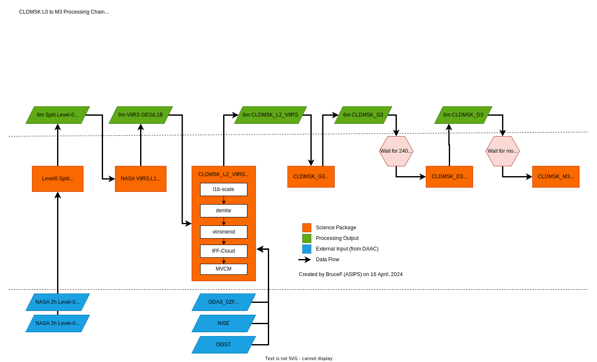

# SITC MDPS Prototype
Code, notes, and other artifacts related to implementing a workflow in MDPS (Unity) for
the purposes of prototyping SITC utility of the system.

The end goal is to implement a pipeline that produces a CLDMSK_M3 product for NOAA20.

The approximate pipeline

## Applicaiton Workflows (`./workflows`)
Workflows that will make up the processing chain documented in the above image.

Current Workflows:
* [l0split](./workflows/l0split/l0split.workflow.cwl)
    - Splits 2h time-based NASA Level-0 PDS files into 6m chunks
* [viirs_l1](./workflows/viirs_l1)
    - Runs NASA VIIRS L1 to product L1B and GEO
    - WIP
* [mvcm_l2](./workflows/mvcm_l2/mvcm_l2.workflow.cwl)
    - Runs L2 software necessary to generate CLDMSK

# References:
* [MDPS/Unity Overview](https://unity-sds.gitbook.io/docs/mdps-overview)
* Examples 
  * [SBG Example Unity Workflows](https://github.com/unity-sds/sbg-workflows/)
  * [Unity Example Application](https://github.com/unity-sds/unity-example-application)
* [Dockstore](https://dockstore.org)
* [Common Workflow Language](https://www.commonwl.org/)
  * [v1.2 Spec](https://www.commonwl.org/v1.2/)
  * [Command Line Tool Reference](https://www.commonwl.org/v1.2/CommandLineTool.html)
  * [Workflow Reference](https://www.commonwl.org/v1.2/Workflow.html)
